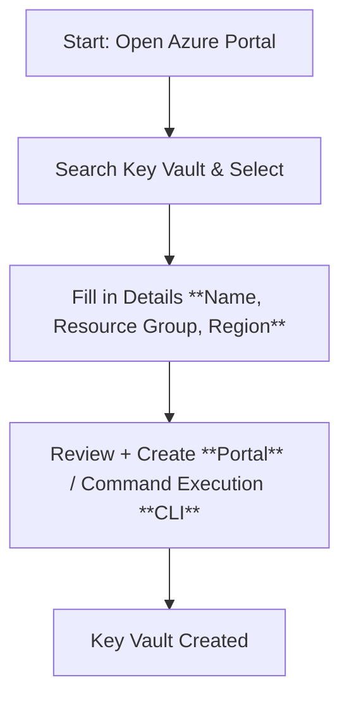
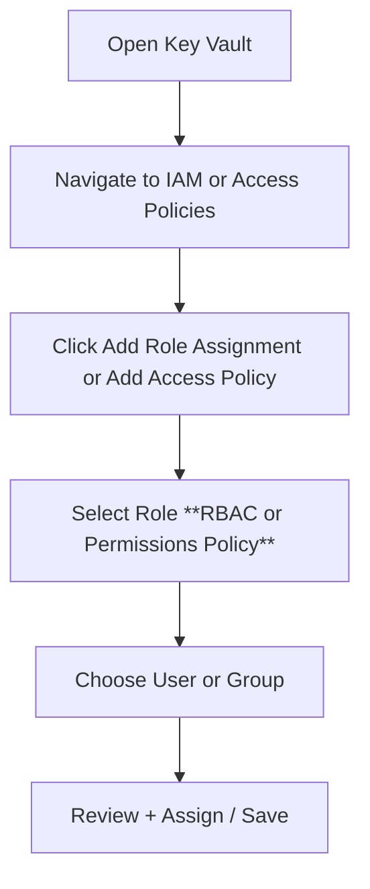
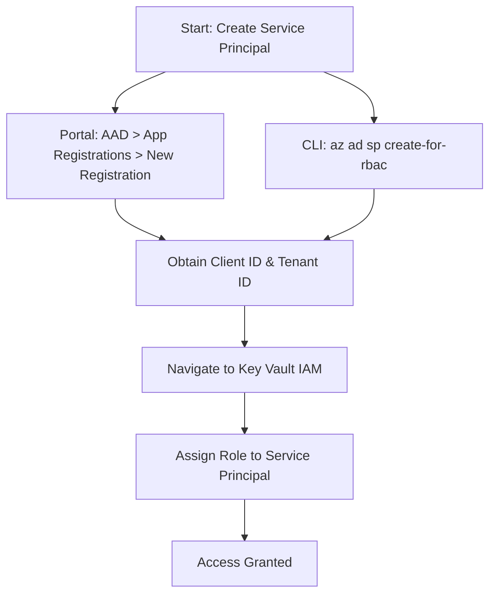
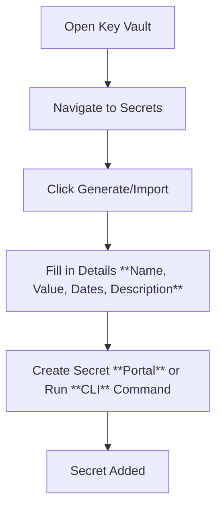
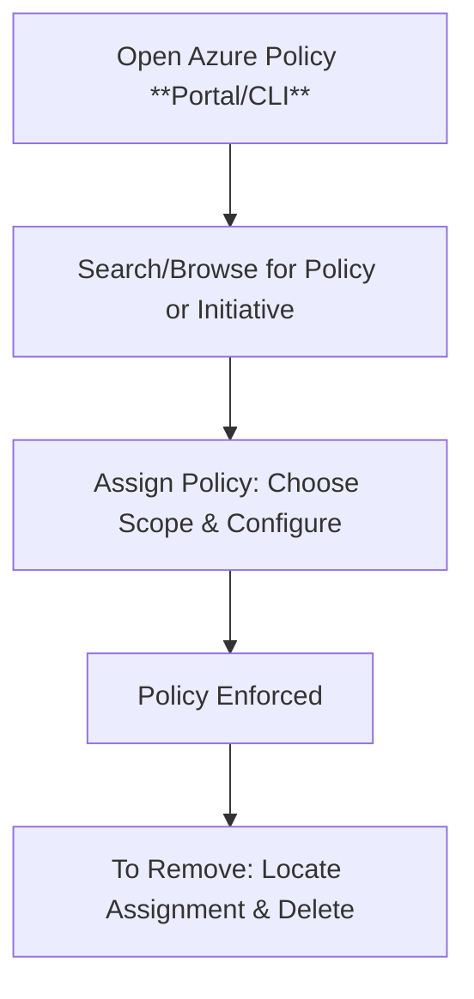

Below is the updated GitHub Wiki Markdown document. It now includes small Mermaid flow charts alongside each major step to help visualize the process for both the Azure Portal and CLI methods.

---

# 🔵 Azure Key Vault: Secrets Management Guide ☁️

This guide explains how to create an Azure Key Vault, manage access for both users and applications, add secrets with detailed metadata, and enforce policies using Azure Policy. Each section includes step-by-step instructions with corresponding Mermaid flow charts for visual clarity.

---

## 📘 Table of Contents

- [🔵 Azure Key Vault: Secrets Management Guide ☁️](#-azure-key-vault-secrets-management-guide-️)
  - [📘 Table of Contents](#-table-of-contents)
  - [🔧 Create Azure Key Vault](#-create-azure-key-vault)
    - [Mermaid Flow Chart](#mermaid-flow-chart)
  - [🔑 Grant Access to Users and Applications](#-grant-access-to-users-and-applications)
    - [👤 User Access (Preferred: Azure RBAC)](#-user-access-preferred-azure-rbac)
    - [Mermaid Flow Chart](#mermaid-flow-chart-1)
    - [🤖 Application Access (Using Service Principals)](#-application-access-using-service-principals)
    - [Mermaid Flow Chart](#mermaid-flow-chart-2)
  - [📥 Add Secrets to Key Vault](#-add-secrets-to-key-vault)
    - [Mermaid Flow Chart](#mermaid-flow-chart-3)
  - [📏 Policy Enforcement with Azure Policy](#-policy-enforcement-with-azure-policy)
    - [Policy vs. Initiative](#policy-vs-initiative)
    - [Mermaid Flow Chart](#mermaid-flow-chart-4)
  - [✅ Summary](#-summary)

---

## 🔧 Create Azure Key Vault

**Steps (Portal & CLI):**

1. **Using the Azure Portal:**  
   - Go to the [Azure Portal](https://portal.azure.com/).  
   - Search for **Key Vault** and select it.
   - Click on **➕ Create a resource**.  

  

1. **Fill in Details:**  
<u>**Basic**</u>

   - **Name:** Unique vault name.  
   - **Subscription:** Select your subscription.  
   - **Resource Group:** Choose or create a resource group.  
   - **Region:** Select your nearest region.
  
  
  
  <u>**Access Configuration**</u>
  - **Permission model:** `Azure role-based access control (recommended)`.
  
  
  
  <u>**Networking**</u>
  - **Public Access:** `All networks`.
  
  

  <u>**Tags**</u> (Optional)
  - **Name:** give some name.
  - **value:** value.

  

  <u>**Finalize:**</u>  
   - **Portal:** Click **`Review + create`**, then **Create**.  

**CLI:** The given command creates the vault immediately.
- **Using the CLI:**  
   - Run the following command (replace placeholders):
     ```bash
     az keyvault create --name <YourKeyVaultName> --resource-group <YourResourceGroup> --location <YourRegion>
     ```

🔗 [Official Docs: Quick Create - Portal](https://learn.microsoft.com/en-us/azure/key-vault/general/quick-create-portal)

### Mermaid Flow Chart



---

## 🔑 Grant Access to Users and Applications

Enhance your security by granting access separately for **users** and **applications**.

### 👤 User Access (Preferred: Azure RBAC)

Azure RBAC is the recommended method as it provides centralized, role-based permissions management.

**Using the Azure Portal:**

1. **Step 1:** Open your Key Vault and navigate to **Access Control (IAM)**.
   


2. **Step 2:** Click **➕ Add role assignment**.


3. **Step 3:** Choose a role (e.g., `Key Vault Reader` or `Key Vault Secrets Officer`).
 


4. **Step 4:** Assign the role to the desired **User or Group**.
   


**`Click Select members.`**


5. **Step 5:** Click **`Review + assign`**.

**Using the CLI:**

```bash
az role assignment create --assignee <user-object-id> --role "Key Vault Secrets Officer" --scope $(az keyvault show --name <YourKeyVaultName> --query id -o tsv)
```

> _Alternate Option: Use Access Policies as a secondary method._  
> **Portal:**  
> - Navigate to **Access Policies** → **➕ Add Access Policy**.  
> - Select desired permissions, click **Select principal**, choose the user, then click **Add** and **Save**.  
> **CLI:**  
> ```bash
> az keyvault set-policy --name <YourKeyVaultName> --upn <user@domain.com> --secret-permissions get list
> ```

🔗 [Docs: RBAC Guide](https://learn.microsoft.com/en-us/azure/key-vault/general/rbac-guide)  
🔗 [Docs: Assign Access Policy](https://learn.microsoft.com/en-us/azure/key-vault/general/assign-access-policy)

### Mermaid Flow Chart



---

### 🤖 Application Access (Using Service Principals)

For application access, you need to create a **service principal** and assign it the appropriate permissions.


**Step 1: Create a Service Principal**

- **Using the Azure Portal:**  
  1. Navigate to **Azure Active Directory** in the [Azure Portal](https://portal.azure.com/).  
  2. Select **App registrations** from the left-hand menu.  
  3. Click **New registration**.  
  4. Enter a **Name**, choose the supported account types, and optionally specify a Redirect URI.  
  5. Click **Register**.  
  6. The app is now registered as a service principal. View its **Application (client) ID** and **Directory (tenant) ID**.

- **Using the CLI:**  
  Run the following command (replace `<YourServicePrincipalName>` with your desired name):
  ```bash
  az ad sp create-for-rbac --name "<YourServicePrincipalName>" --skip-assignment
  ```

**Step 2: Assign Permissions via RBAC**

- **Using the Azure Portal:**  
  1. Open your Key Vault and navigate to **Access Control (IAM)**.  
  2. Click **➕ Add role assignment**.  
  3. Choose a role such as `Key Vault Secrets Officer`.  
  4. In the **Select members** section, search for the service principal you just created.  
  5. Click **Review + assign**.

- **Using the CLI:**

  ```bash
  az role assignment create --assignee <service-principal-id> --role "Key Vault Secrets Officer" --scope $(az keyvault show --name <YourKeyVaultName> --query id -o tsv)
  ```

🔗 [Docs: Creating a Service Principal](https://learn.microsoft.com/en-us/cli/azure/create-an-azure-service-principal-azure-cli)

### Mermaid Flow Chart



---

## 📥 Add Secrets to Key Vault


When adding a secret, include detailed metadata for enhanced management:

**Using the Azure Portal:**

1. **Step 1:** Navigate to your Key Vault → Click **Secrets** → **➕ Generate/Import**.
2. **Step 2:** Choose **Upload Options**: `Manual`.
3. **Step 3:** Fill in the details:  
   - **Name:** A unique identifier for the secret.  
   - **Value:** The secret data (e.g., password, connection string).  
   - **Activation Date:** (Optional) When the secret becomes active.  
   - **Expiration Date:** (Optional) When the secret will expire.  
   - **Content Type/Description:** (Optional) Additional details about the secret.
4. **Step 4:** Click **Create**.

**Using the CLI:**

```bash
az keyvault secret set --vault-name <YourKeyVaultName> --name <SecretName> --value "<SecretValue>" --description "<Description>" --expires <ExpirationDate> --not-before <ActivationDate>
```

🔗 [Docs: Add Secret - Portal](https://learn.microsoft.com/en-us/azure/key-vault/secrets/quick-create-portal)

### Mermaid Flow Chart




---

## 📏 Policy Enforcement with Azure Policy


Azure Policy helps enforce your organizational standards across resources.

### Policy vs. Initiative

- **Policy:**  
  A single rule that evaluates resources against specific conditions (e.g., ensuring secure Key Vault settings).

- **Initiative:**  
  A collection of related policies grouped together for broader compliance goals, simplifying management.

**Enforcing or Removing Policies on Key Vault:**

**Using the Azure Portal:**

- **To Enforce a Policy:**  
  1. **Step 1:** Navigate to **Azure Policy** in the [Azure Portal](https://portal.azure.com/#blade/Microsoft_Azure_Policy/PolicyMenuBlade/Overview).  
  2. **Step 2:** Browse or search for a built-in policy or initiative (e.g., targeting Key Vault configurations).  
  3. **Step 3:** Click **Assign**, choose the scope (subscription/resource group), and complete the assignment.

- **To Remove a Policy:**  
  1. **Step 1:** In **Azure Policy**, go to **Assignments**.  
  2. **Step 2:** Locate the policy or initiative assigned to your Key Vault.  
  3. **Step 3:** Select the assignment and click **Delete** or **Remove Assignment**.

**Using the CLI:**

- **To Enforce a Policy:**
  ```bash
  az policy assignment create --policy <policy-definition-id> --scope $(az keyvault show --name <YourKeyVaultName> --query id -o tsv)
  ```
- **To Remove a Policy:**
  ```bash
  az policy assignment delete --name <assignment-name>
  ```

🔗 [Docs: Azure Policy Overview](https://learn.microsoft.com/en-us/azure/governance/policy/overview)  
🔗 [Docs: Manage Policy Assignments](https://learn.microsoft.com/en-us/azure/governance/policy/how-to/assign-policy-portal)

### Mermaid Flow Chart



---

## ✅ Summary

Azure Key Vault provides a secure platform to store and manage sensitive data. By leveraging:  
- **Azure RBAC** for user and application access (with service principals created via the Portal or CLI),  
- Detailed secret metadata for robust secret management, and  
- **Azure Policy** to enforce compliance,  

you can achieve enterprise-grade security and governance for your critical assets.

Feel free to clone this document into your GitHub Wiki repository and adjust images, flow charts, or links as needed. Enjoy secure and streamlined secret management with Azure!

---
